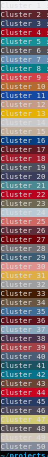

# Livrable 2

## Jeu de données
Nous utilisons un jeu de données provenant de https://github.com/yumingj/DeepFashion-MultiModal. Il contient 44 096 photos de mannequin dont beaucoup sont dupliquées avec des angles différents. Nous n'avons besoin que des photos où on voit le mannequin dans son ensemble (haut et bas) donc nous avons filtré le jeu données pour ne garder que les photos exploitables. Les images étant de relativement grande taille (environ 1000x1000), nous avons redimensionné les images afin d'accélérer le temps de traitement par la suite.
Le jeu de donnée filtré et redimensionné est disponible [ici](https://drive.google.com/drive/folders/1_du47YFJGXp0veHWjdE59SLThpPCwxqg?usp=drive_link).

Script de filtrage basé sur le nom des fichiers :
```python
import glob
import os

images_path = "images/original"
trash_path = "images/trash"

original_files = glob.glob(images_path + "/*.jpg")

# for each image id, if there is a full type, keep only the full type
# otherwise, keep front and additional types because they can be fullbodies
for file in original_files:
    filename = file.split("/")[-1]
    similars = glob.glob(images_path + "/*" + filename.split("_")[2]+"*")
    if len(similars) >= 2:
        has_full = any("_full" in sim for sim in similars)
        if has_full:
            for similar in similars:
                if "_full" in similar:
                    continue
                else:
                    os.replace(similar, trash_path + "/" + similar.split("/")[-1])
        else:
            for similar in similars:
                if "_front" in similar or "_additional" in similar:
                    continue
                else:
                    os.replace(similar, trash_path + "/" + similar.split("/")[-1]) 
```

Script de redimensionnement des images :
```python
import cv2
import glob

images_path = "images/original"
resized_path = "images/resized"

original_files = glob.glob(images_path + "/*")

# resize images by 50%
for file in original_files:
    img = cv2.imread(file)
    img_50 = cv2.resize(img, None, fx = 0.50, fy = 0.50)
    cv2.imwrite(compressed_path + "/" + file.split("/")[-1], img_50)
```

Ce jeu de données présente tout de même plusieurs biais :
- Après filtrage, nous avons 1626 images d'hommes et 12 569 images de femmes.
- Les images proviennent d'une source occidentale donc toutes les populations et style ne sont pas représentées.
- Les images sont de qualité professionnelle avec une lumière permettant de bien percevoir les couleurs. Ce ne sera pas forcément le cas de photos prises par des utilisateurs donc le jeu de données ne représente pas parfaitement la réalité de notre cas d'usage.


## Traitement d'image

Le premier traitement a été d'extraire les couleurs des vêtements portés par les mannequins de notre jeu de données ainsi que leur teinte de peau.
Pour ce faire, on a utilisé le [modèle pré-entrainé de segmentation](https://huggingface.co/mattmdjaga/segformer_b2_clothes). Il y a 17 catégories de segmentation différentes. Pour des hommes, on s'interesse à 3 categories: haut, bas et peau. Pour des femmes, on s'interesse à 4 categories: haut, bas, peau, jupe (ce qui peut être considéré comme une combinaison de haut et bas). On ne prend pas en compte des images dont l'une des catégories n'est pas présente.

Pour chaque segment, on a obtenu un masque binaire. On a ensuite appliqué ce masque sur l'image originale pour obtenir une image avec seulement le segment qui nous intéresse. On a ensuite extrait les couleurs dominantes de chaque segment. Il y a une difficulté de la couleur de fond qui peut être confondue avec la couleur dominante du segment. Pour éviter cela, on a transformé les images en RGBA et mettre la valeur d'opacité à 0 pour le fond. Cela permet bien déterminer la couleur dominante de chaque segment sans prendre en compte le fond. On a ensuite utilisé la librairie [extcolors](https://pypi.org/project/extcolors/) pour extraire les couleurs dominantes de chaque segment.


## Cluster

Une fois les couleurs extraites et stockées sous format RGB, on a utilisé la librairie Scikit-Learn pour tester ses fonctionnalités de clustering. L'objectif était de créer des groupes de couleurs qui se ressemblent à partir du jeu de données construit. Les clusters créés n'étaient pas satisfaisants, les couleurs associées se ressemblaient trop.

C'est pour cela qu'on s'est orienté vers un espace de couleur plus représentatif de la perception de l'oeil humain : le LAB. Les couleurs associées aux clusters diffèrent comme on le souhaitait.




## Application

Maintenant que notre processus de regroupement des couleurs est prêt, on va pouvoir l'appliquer à nos données. On va créer des regroupements de teinte de peau (de l'ordre de 3 à 5 groupes), pour ensuite créer des regroupements de couleurs de vêtements pour chaque groupe de teinte de peau. On va donc pouvoir créer des groupes de vêtements qui vont bien ensemble pour chaque groupe de teinte de peau.

Enfin, on pourra créer une application qui permettra à l'utilisateur de choisir sa teinte de peau et de voir les vêtements qui vont bien avec. On pourra aussi lui proposer des photos de manequins qui ont la même teinte de peau que lui pour qu'il puisse se projeter.