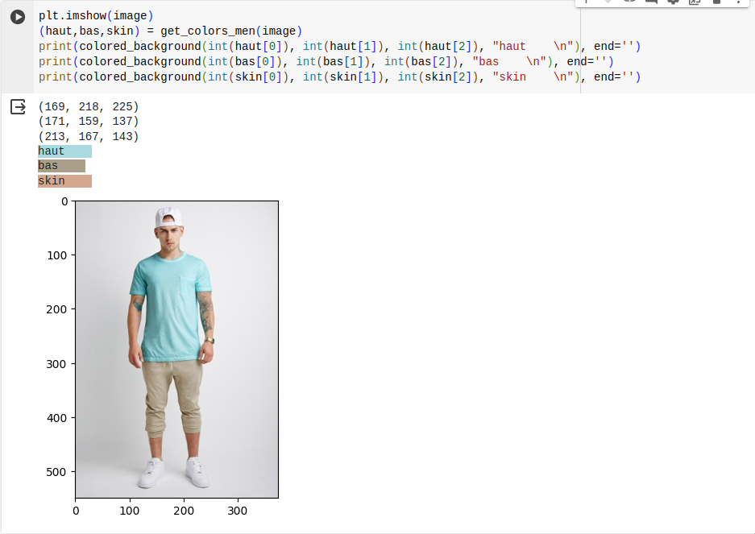
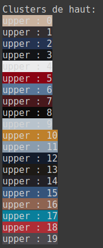
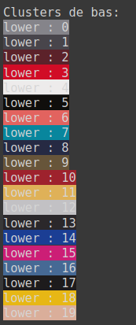
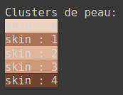
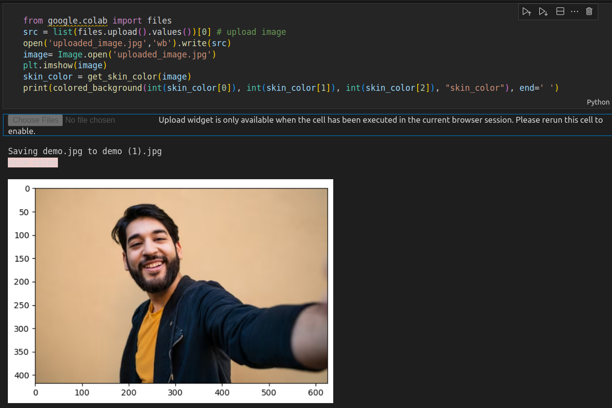
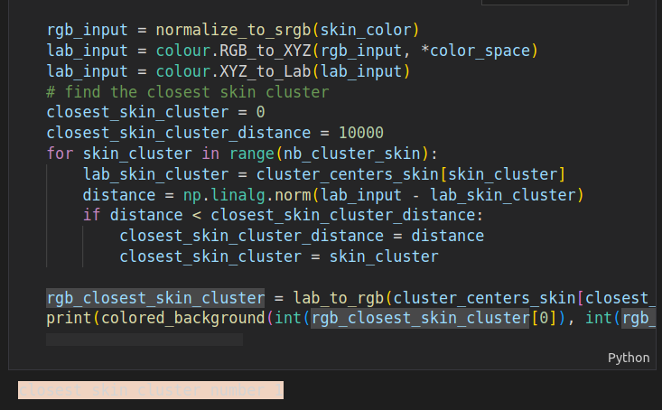
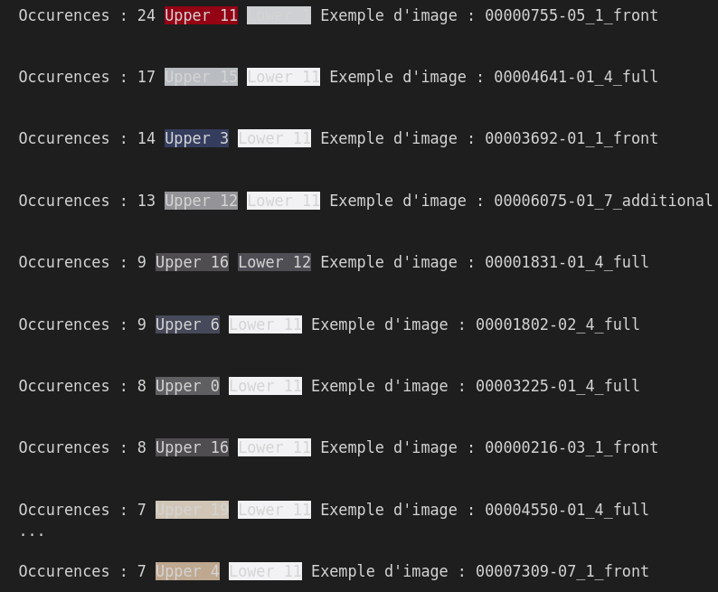

# Livrable 3 : Preuve de concept

Notre travail se décompose en deux notebooks python. Le premier permet de détecter les tuples (couleur de peau, couleur du haut, couleur du bas) de photos de personne. Le second permet de clusteriser les couleurs de chaque photo afin de construire une matrice d'occurences par couleur de chacun de nos tuples.

## Détection des couleurs des photos
Le notebook python ainsi l'explication de son contenu se trouve à l'adresse suivante : https://colab.research.google.com/drive/19Hn6Y-09XlVNDg7Hp798v5ZL41UBsx8S?usp=sharing

Pour chaque image, nous extrayons les couleurs dominantes des masques de haut, bas et de couleur de peau. Pour les femmes, une robe est considérée comme un tuple (haut, bas). 

## Clustering des couleurs et matrice d'occurences
Le notebook python ainsi l'explication de son contenu se trouve à l'adresse suivante : https://colab.research.google.com/drive/10GGzqcxp0jIl4kTurNXCNJLFwRQY8UVE?usp=sharing

### Clustering
On a choisi de faire trois clustering, un pour les couleurs de haut (20 clusters), un autre pour les couleurs de bas (20 clusters) et un dernier pour les couleurs de peau (5 clusters).

### Matrice d'occurences par couleurs
À partir des clusters de couleurs et des tuples (peau, haut, bas), on construit une matrice d'occurences par couleurs afin de déterminer les combinaisons les plus populaires.

### Utilisation de la matrice
#### 1. Chargement d'une photo
Notre notebook permet de prendre en entrée un fichier d'un utilisateur comme ceci :

#### 2. Détection de la couleur de peau
On va alors chercher à détecter la couleur de peau de la personne sur la photo et à trouver le cluster de couleur de peau le plus proche qui lui correspond :

#### 3. Récupération des plus grandes occurences
Pour le cluster de couleur de peau correspondant, on affiche les 10 occurences les plus populaires avec les couleurs de haut et de bas ainsi que le nom d'une image d'exemple :

## Suite du projet
Plusieurs pistes d'améliorations sont envisageables pour l'usage d'une photo d'un utilisateur :
- Donner un score de compatibilité pour la tenue
- Proposer des alternatives de couleur de tenue
- Proposer des exemples de tenues à partir de notre dataset correspondant aux palettes de couleurs les plus populaires
- Expérimenter sur divers points :
    - distinguer les hommes et les femmes pour nos clusters
    - changer le nombre de clusters
    - tester avec un autre dataset de photos