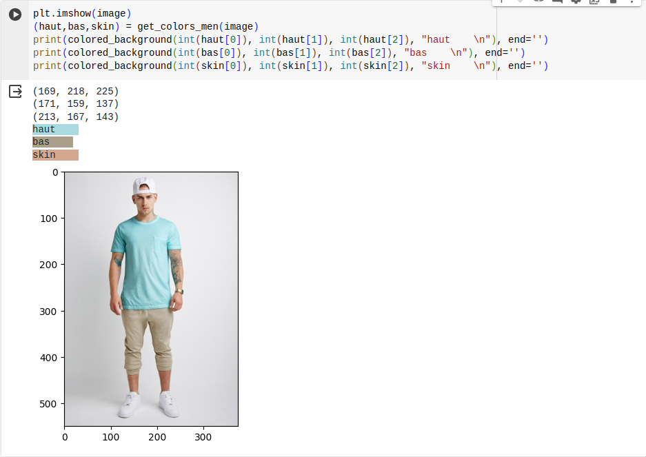
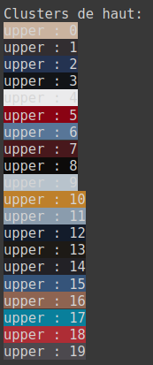
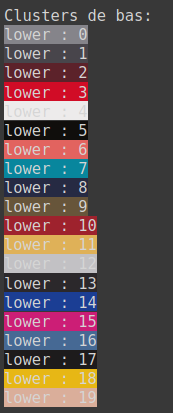
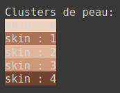
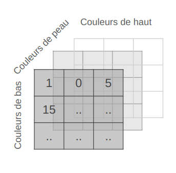

# Livrable final

## Présentation du problème traité

Nous souhaitons proposer des idées de tenues vestimentaires en fonction de la personne. Pour simplifier le problème, nous avons décidé de nous concentrer sur l’association des couleurs des vêtements et de la couleur de la peau d’une personne. Nous cherchons à trouver les tuples de couleurs (peau, haut, bas) qui vont bien ensemble en se reposant sur des photos de mannequins. On peut ainsi suggérer des palettes de couleurs (haut, bas) à partir d’une teinte de peau.

## Données utilisées

Nous utilisons deux datasets pour les photos de mannequins :

- [DeepFashion](https://github.com/yumingj/DeepFashion-MultiModal) : Il contient 44 096 photos de mannequin dont beaucoup sont dupliquées avec des angles différents. Nous n'avons besoin que des photos où on voit le mannequin dans son ensemble (haut et bas) donc nous avons filtré le jeu données pour ne garder que les photos exploitables. Les images étant de relativement grande taille (environ 1000x1000), nous avons redimensionné les images afin d'accélérer le temps de traitement par la suite.

Script de filtrage basé sur le nom des fichiers :

```python
import glob
import os

images_path = "images/original"
trash_path = "images/trash"

original_files = glob.glob(images_path + "/*.jpg")

# for each image id, if there is a full type, keep only the full type
# otherwise, keep front and additional types because they can be fullbodies
for file in original_files:
    filename = file.split("/")[-1]
    similars = glob.glob(images_path + "/*" + filename.split("_")[2]+"*")
    if len(similars) >= 2:
        has_full = any("_full" in sim for sim in similars)
        if has_full:
            for similar in similars:
                if "_full" in similar:
                    continue
                else:
                    os.replace(similar, trash_path + "/" + similar.split("/")[-1])
        else:
            for similar in similars:
                if "_front" in similar or "_additional" in similar:
                    continue
                else:
                    os.replace(similar, trash_path + "/" + similar.split("/")[-1])
```

Script de redimensionnement des images :

```python
import cv2
import glob

images_path = "images/original"
resized_path = "images/resized"

original_files = glob.glob(images_path + "/*")

# resize images by 50%
for file in original_files:
    img = cv2.imread(file)
    img_50 = cv2.resize(img, None, fx = 0.50, fy = 0.50)
    cv2.imwrite(resized_path + "/" + file.split("/")[-1], img_50)
```

- [Style du Monde](https://styledumonde.com/) : 7 841 photos ont constitué notre deuxième dataset. Ce site web partage des photographies de célébrités prises dans la rue ou lors d'évènements importants dans le domaine de la mode. L'intérêt était d'explorer des personnes pouvant porter des habits de tous les jours mais aussi plus originales. Nous avons scrapé toutes les photos proposées de Juillet 2008 à Septembre 2023 avec l'utilisation de _Scrapy_ et retirer celles inexploitables (plusieurs personnes présentes, personne / visage non visible, pas une photo en pied...). Les photos ont été redimensionnées afin d'accélérer le temps de traitement par la suite.

Pour le scrapping, l'idée était de récupérer toutes les photos du site par année, en parcourant toutes les pages et les stocker dans un dossier. Le script ci-dessous a été lancé manuellement pour chaque année.

Script de scrapping :

```python
import scrapy
import urllib.request

class modelsSpider(scrapy.Spider):
  name = "models"

  def start_requests(self):
    urls = [
      # "https://styledumonde.com/2008",
      # "https://styledumonde.com/2009",
      # "https://styledumonde.com/2010",
      "https://styledumonde.com/2011",
      # "... until 2023",
    ]
    # add the url of all the pages for the corresponding year
    for i in range (2, 4): # TODO: update the last index corresponding to the year
      urls.append("https://styledumonde.com/2011/page/"+str(i))
    for url in urls:
      yield scrapy.Request(url=url, callback=self.parse)

  def parse(self, response):
    delimiter = 'jpg'
    imgs = [img.attrib["src"] for img in response.css("img.attachment-original")]
    for img in imgs:
      urllib.request.urlretrieve(img, "scrapped_img/"+img.split("/")[-1].split(delimiter)[0]+delimiter)
```

Les jeux de données filtrés et redimensionnés sont disponibles [ici](https://drive.google.com/drive/folders/1_du47YFJGXp0veHWjdE59SLThpPCwxqg?usp=drive_link).

Ces jeux de données présentent tout de même plusieurs biais :

- Après filtrage, nous avons 1626 images d'hommes et 12 569 images de femmes dans le dataset DeepFashion.
- Dans le dataset Style du Monde, une prédominance des photos de femmes par rapport aux hommes est aussi présent mais nous n'avons pas séparé les photos par rapport au genre ce qui fait que ce jeu de données n'est pas exploitable pour les hommes.
- Les images proviennent d'une source occidentale donc toutes les populations et style ne sont pas représentées.
- Les images sont de qualité professionnelle avec une lumière permettant de bien percevoir les couleurs. Ce ne sera pas forcément le cas de photos prises par des utilisateurs donc le jeu de données ne représente pas parfaitement la réalité de notre cas d'usage.

Nous utilisons également un modèle pré-entraîné pour la détection de personnes et des habits : [Segformer](https://huggingface.co/mattmdjaga/segformer_b2_clothes). Ce modèle nous permet de distinguer le haut, le bas et la couleur de peau d’une personne.

## Méthodes utilisées et leur justification

### Détection des couleurs des photos

Pour chaque image, nous extrayons les couleurs dominantes des masques de haut, bas et de couleur de peau. Pour cet étape, on a utilisé le [modèle pré-entrainé de segmentation](https://huggingface.co/mattmdjaga/segformer_b2_clothes). Il y a 17 catégories de segmentation différentes. Pour les hommes, on s'intéresse à 3 catégories : haut, bas et peau. Pour les femmes, on s'intéresse à 5 catégories: haut, bas, peau, jupe et robe (qui peut être considéré comme une combinaison de haut et bas). On ne prend pas en compte les images dont l'une des catégories n'est pas présente.

Pour chaque segment, on a obtenu un masque binaire. On applique ce masque sur l'image originale pour obtenir une image avec seulement le segment qui nous intéresse et on extrait ensuite les couleurs dominantes de chaque segment. Il y a eu une difficulté sur la couleur de fond qui pouvait être confondue avec la couleur dominante du segment (la couleur noire). Pour éviter cela, on a transformé les images en RGBA et mis la valeur d'opacité à 0 pour le fond. Cela permet bien déterminer la couleur dominante de chaque segment sans prendre en compte le fond. On a ensuite utilisé la librairie [extcolors](https://pypi.org/project/extcolors/) pour extraire les couleurs dominantes de chaque segment.



### Clustering des couleurs

Le clustering repose sur la bibliothèque scikit-learn avec la méthode des k-means. Nous avons fait ce choix car dès le départ les résultats étaient probants. Cet algorithme nous a paru être le plus intuitif ce qui permet d'accélérer le développement du projet. On fait du clustering dans un domaine à 3 dimensions pour les 3 composantes permettant de définir une couleur.

On s’est tourné vers le domaine de couleur L\*a\*b\* pour faire le clustering. On s’était rendu compte que le domaine RGB n’était pas la meilleure solution pour faire nos groupes de couleur. Les clusters avaient tendance à se former autour de la diagonale du cube représentant les composantes RGB. Donc on se retrouvait avec des clusters représentant des nuances de gris.

Résultats du clustering dans le domaine Lab :




### Matrice d'occurences

À partir des clusters de couleurs et des tuples (peau, haut, bas), on construit autant de matrices d'occurences que de clusters de couleur de peau. Pour chaque cluster de couleur de peau, on construit une matrice d'occurences par couleur afin de déterminer les combinaisons les plus populaires.



### Évaluation de tenue

Lorsque l'utilisateur télécharge une photo de son corps entier, notre application extrait les couleurs dominantes de la peau, du haut et du bas. Si cette combinaison de couleurs est présente dans les matrices d'occurrences, nous attribuons une note à la tenue en fonction de sa popularité, avec un seuil minimum de 70. En cas d'absence de cette combinaison, nous évaluons la tenue en considérant la présence individuelle de la couleur du haut et du bas dans les matrices d'occurrences. Dans ce cas, la note attribuée varie entre un seuil maximum de 70.

## Évaluation des aspects environnementaux et sociétaux

L’outil que nous avons créé a un impact environnemental et sociétal tant sur le plan de la conception que sur celui de l’utilisation.

### Impact de la conception

Notre équipe est composé de 4 personnes et nous avons effectué la totalité du projet sur nos machines personnelles :

- 2x Dell XPS 13 9310 avec une batterie de 52Wh et une autonomie de [10h57](https://www.notebookcheck.biz/Test-du-Dell-XPS-13-9310-i7-1165G7-FHD-le-processeur-Tiger-Lake-de-11e-generation-fait-la-difference.501538.0.html) soit une puissance d'environ 4,74W
- 1x Huawei MateBook 13 avec une batterie de 41,7Wh et une autonomie de [7h37](https://www.notebookcheck.biz/Critique-complete-de-l-ultraportable-Huawei-MateBook-13-i7-8565U-GeForce-MX150.401626.0.html#toc-7) soit une puissance d'environ 5,47W
- 1x LG Gram 16Z90P avec une batterie de 80Wh et une autonomie de [15h43](https://www.notebookcheck.biz/Test-du-LG-Gram-16-2021-1-200-grammes-excellente-autonomie-ecran-16-10.543654.0.html) soit une puissance d'environ 5,09W

Pour la phase de détection des couleurs sur nos datasets, nous avons utilisé le modèle [Segformer pré-entraîne](https://huggingface.co/mattmdjaga/segformer_b2_clothes) sur la plateforme Google Colab avec leur GPU T4. Le temps total pour traiter les deux datasets a été d'environ 11h. D'après la [documentation de NVIDIA](https://www.nvidia.com/content/dam/en-zz/Solutions/design-visualization/solutions/resources/documents1/Datasheet_NVIDIA_T4_Virtualization.pdf), leur GPU T4 a une puissance de 70W. Le traitement sur Google Colab nécessite que la machine qui lance le script reste actif : DeepDashion a été traité sur un XPS 13 pour une durée de 6h et Style du Monde a été traité sur un MateBook 13 pour une durée de 5h. On peut donc estimer que le coût énergétique de la phase de détection des couleurs est de 0,82579 kWh (70\*11 + 4,74\*6 + 5,47\*5).

En estimant notre temps de travail sur ce projet à 18 heures (12 séances de 1h30), on obtient une consommation énergétique de 18\*4,74\*2 + 18\*5,47 + 18\*5,09 = 0,36072 kWh. Ce qui mène à un total de 0,36072 + 0,82579 = 1,18651 kWh, soit 1,18651 \* [0,05](https://www.objectifco2.fr/docs/upload/52/R%C3%A9f%C3%A9rentiel%20des%20facteurs%20d%27%C3%A9missions%20-%202023.pdf) = 0.059 kgCO2eq.

Pour ce qui est du clustering et de la génération des matrices d'occurences, nous avons utilisé la même configuration que pour la phase de détection des couleurs. Le temps total de traitement est de l'ordre de la minute. On peut donc estimer que le coût énergétique de cette phase est de quelques Wh.

Ayant le devoir de réaliser le projet sur place, nous optons de nous déplacer avec les transports en commun. Selon les chiffres de l'ADEME, le tramway émet [0,004 kgCO2e/km](https://impactco2.fr/transport/tramway) et le bus à moteur thermique émet [0,11 kgCO2e/km](https://impactco2.fr/transport/busthermique) par personne en France. Notre consommation d'émission carbone en termes de transport est de 5,3km \* 0,004 + 4,5km \* 0,004 \* 2 + 1,4km \* 0,11 = 0.2112 kgCO2eq, soit environ 5 kgCO2eq pour la totalité des trajets aller-retours sur les 12 séances.

### Impact de l'utilisation

Le fait que notre application fasse des suggestions relatifs au style vestimentaire engendre des conséquences potentielles en matière de surconsommation de vêtements et donc de surconsommation de ressources et d'énergie. Il y a également le risque de normalisation des styles vestimentaires dictée par l'IA qui soulève des questions sur la diversité et l'individualité de l'expression personnelle.

Nous sommes également conscient que notre application porte sur les points sensibles que sont la couleur de peau et le traitement d'image personnelle. Dans le cadre de notre projet, des limites techniques et financières ont fait que nous avons déployé notre application sur un serveur tiers (Streamlit) et que nous avons hébergé les clusters et les matrices d'occurrences générés sur un dépôt GitHub public. Nous avons conscience que cela peut poser des problèmes de sécurité et de confidentialité. Nous avons donc réfléchi à des solutions pour pallier à ces problèmes :

- Flouter la photo qu'envoie l'utilisateur pour l'anonymiser
- Éviter d'utiliser un serveur tiers pour déployer notre application
- Chiffrer les échanges entre l'utilisateur et le serveur

## Bibliographie

- WANG Xinhui. _Towards color compatibility in fashion using machine learning._ Consulté le 18 janvier 2024. https://www.diva-portal.org/smash/get/diva2:1348501/FULLTEXT01.pdf

- XIE Enze, WANG Wenhai, YU Zhiding, ANANDKUMAR Anima, ALVAREZ Jose M.,LUO Ping. _SegFormer: Simple and Efficient Design for Semantic Segmentation with Transformers._ Consulté le 18 janvier 2024. https://huggingface.co/mattmdjaga/segformer_b2_clothes

- JIANG Yuming, YANG Shuai, QIU Haonan, WU Wayne, LOY Chen Change, LIU Ziwei. _Text2Human: Text-Driven Controllable Human Image Generation._ Consulté le 18 janvier 2024. https://github.com/yumingj/DeepFashion-MultiModal

- Site officiel du Style du Monde. Consulté le 18 janvier 2024. https://styledumonde.com/

_Pour la partie Impact de la conception_

- ADEME. _Quelle est l'empreinte carbone de vos déplacements ? Avec Impact CO₂ vous connaitrez votre impact sur le climat_ Consulté le 20 janvier 2024. https://impactco2.fr/transport/

- Allen Ngo. _Test du Dell XPS 13 9310 (i7-1165G7, FHD+) : le processeur Tiger Lake de 11e génération fait la différence_ Consulté le 20 janvier 2024. https://www.notebookcheck.biz/Test-du-Dell-XPS-13-9310-i7-1165G7-FHD-le-processeur-Tiger-Lake-de-11e-generation-fait-la-difference.501538.0.html

- Allen Ngo. _Critique complète de l'ultraportable Huawei MateBook 13 (i7-8565U, GeForce MX150)_ Consulté le 20 janvier 2024. https://www.notebookcheck.biz/Critique-complete-de-l-ultraportable-Huawei-MateBook-13-i7-8565U-GeForce-MX150.401626.0.html#toc-7

- Stephanie Chamberlain. _Test du LG Gram 16 (2021) : 1 200 grammes, excellente autonomie, écran 16:10_ Consulté le 20 janvier 2024. https://www.notebookcheck.biz/Test-du-LG-Gram-16-2021-1-200-grammes-excellente-autonomie-ecran-16-10.543654.0.html

## Code source

Le code source est disponible sur le dépôt GitHub du projet : https://github.com/Nielk74/ia-clothes.

Pour comprendre sont contenu, il faut se référer au fichier README.md du dépôt.
